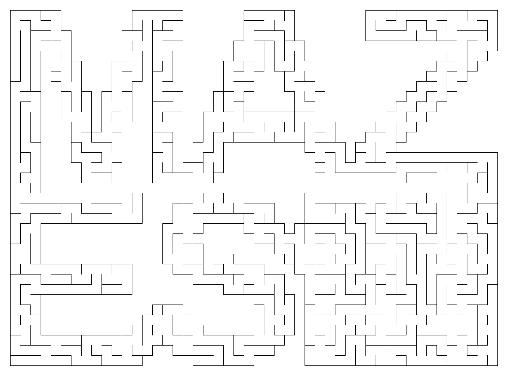
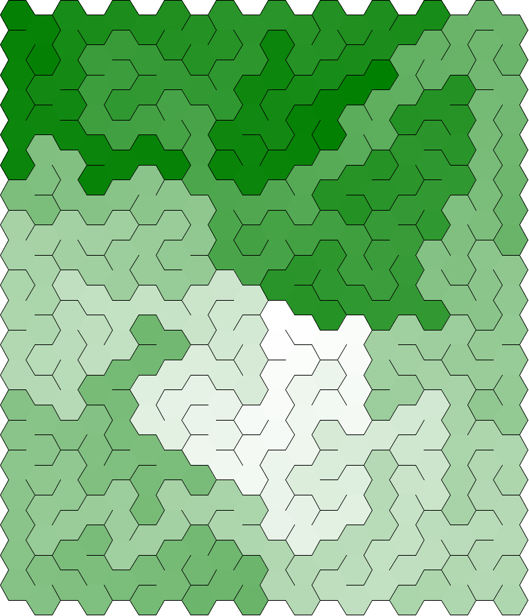
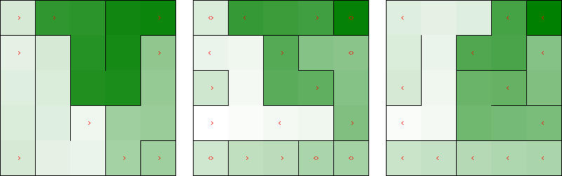

# 🌾 Mazes for Programmers



This is an implementation of [Mazes for Programmers](http://www.mazesforprogrammers.com/) in Rust. The book is really fun to work through, I highly recommend it!

## Gallery

These are just a few of my favourites, check out [/images](/images) for more! 

> [!NOTE]
> The colors help show the "texture" of the maze, with white being closest to the starting point and green being the furthest.

### Circular, Hex, and Triangle Mazes

 



### Braided and Weaved Mazes


### Prim's Algorithm


### Recursive Division


### 3D Maze in Layers from Left to Right



### Maze Drawn with Unicode Boxes

```
┌───┬───────────┬───────────────────────┬───────────────────────┬───────────────────┬───┬───────────┐
│   │           │                       │                       │                   │   │           │
│   ╵   ╷   ┌───┘   ╶───┐   ┌───────────┘   ╷   ╶───┐   ┌───────┘   ┌───╴   ┌───╴   │   │   ┌───┐   │
│       │   │           │   │               │       │   │           │       │       │   │   │   │   │
│   ┌───┘   │   ┌───┬───┘   │   ╶───┬───────┴───┐   │   │   ┌───────┘   ┌───┘   ┌───┘   ╵   │   │   │
│   │       │   │   │       │       │           │   │   │   │           │       │           │   │   │
│   │   ┌───┘   │   │   ╶───┼───╴   │   ┌───╴   │   └───┘   │   ┌───────┘   ╶───┼───────┐   ╵   │   │
│   │   │       │   │       │       │   │       │           │   │               │       │       │   │
├───┘   │   ╶───┤   └───┐   │   ╶───┴───┘   ╷   ├───────────┤   └───────┬───╴   ╵   ╷   └───┬───┘   │
│       │       │       │   │               │   │           │           │           │       │       │
│   ╷   ├───┐   │   ╶───┤   ╵   ┌───────────┤   ╵   ╷   ┌───┴───┐   ╷   └───────────┼───╴   │   ╷   │
│   │   │   │   │       │       │           │       │   │       │   │               │       │   │   │
│   │   ╵   │   │   ╷   └───────┤   ┌───╴   └───────┴───┘   ╷   └───┴───────┐   ╷   │   ╶───┘   │   │
│   │       │   │   │           │   │                       │               │   │   │           │   │
│   ├───╴   │   └───┤   ╷   ╷   │   │   ┌───────┬───────────┼───────────┐   └───┘   ├───┬───────┤   │
│   │       │       │   │   │   │   │   │       │           │           │           │   │       │   │
│   │   ┌───┴───┐   ├───┘   │   │   └───┘   ╷   │   ╷   ╷   └───╴   ┌───┴───┬───────┤   ╵   ╷   ╵   │
│   │   │       │   │       │   │           │   │   │   │           │       │       │       │       │
│   │   ╵   ┌───┘   ╵   ┌───┴───┴───────────┤   └───┤   ├───┐   ┌───┘   ╷   ╵   ╷   ╵   ┌───┴───────┤
│   │       │           │                   │       │   │   │   │       │       │       │           │
│   └───────┤   ┌───────┤   ╶───┬───┬───╴   ├───╴   │   │   ╵   │   ╶───┴───┬───┴───┬───┘   ╷   ╶───┤
│           │   │       │       │   │       │       │   │       │           │       │       │       │
│   ┌───╴   │   │   ╷   ├───╴   │   │   ╶───┤   ┌───┘   │   ╶───┴───┬───╴   ╵   ╷   └───┐   └───┐   │
│   │       │   │   │   │       │   │       │   │       │           │           │       │       │   │
│   │   ╶───┘   │   │   ╵   ┌───┘   └───╴   │   │   ╷   ├───────────┘   ┌───────┴───┐   ├───╴   │   │
│   │           │   │       │               │   │   │   │               │           │   │       │   │
│   ├───────┬───┘   ├───────┘   ┌───────────┤   ├───┘   │   ┌───────────┤   ┌───┐   │   └───────┘   │
│   │       │       │           │           │   │       │   │           │   │   │   │               │
│   ╵   ╷   │   ╶───┤   ┌───────┴───╴   ╷   ╵   │   ╷   │   │   ┌───────┘   ╵   │   └───────────────┤
│       │   │       │   │               │       │   │   │   │   │               │                   │
├───────┴───┴───╴   │   ╵   ╷   ┌───────┼───────┘   └───┘   ╵   │   ╶───┬───────┼───────┐   ╶───┐   │
│                   │       │   │       │                       │       │       │       │       │   │
│   ╶───┬───╴   ┌───┴───┐   ├───┘   ╷   ├───────┬───────────────┘   ┌───┘   ╷   ╵   ╷   ├───╴   │   │
│       │       │       │   │       │   │       │                   │       │       │   │       │   │
│   ╷   │   ┌───┘   ╷   └───┤   ┌───┘   │   ╷   ╵   ┌───────────────┤   ╶───┴───┬───┘   └───────┘   │
│   │   │   │       │       │   │       │   │       │               │           │                   │
├───┘   ├───┘   ┌───┴───┐   │   │   ╶───┤   └───┬───┘   ╷   ┌───────┴───┬───╴   ├───────────────────┤
│       │       │       │   │   │       │       │       │   │           │       │                   │
│   ╷   │   ┌───┤   ╷   │   ╵   └───┐   └───┐   ╵   ┌───┘   │   ╶───┐   ╵   ╷   │   ┌───────────┐   │
│   │   │   │   │   │   │           │       │       │       │       │       │   │   │           │   │
│   │   │   │   ╵   │   └───────┬───┘   ┌───┴───────┤   ┌───┴───┐   └───────┼───┘   │   ╷   ╶───┘   │
│   │   │   │       │           │       │           │   │       │           │       │   │           │
│   ├───┘   ├───────┤   ┌───╴   │   ┌───┘   ╷   ╶───┘   │   ╶───┴───────┐   └───────┤   └───────┬───┤
│   │       │       │   │       │   │       │           │               │           │           │   │
│   │   ┌───┘   ╷   ╵   ├───────┘   │   ┌───┴───────┬───┴───────┬───╴   ├───┐   ╷   ├───────┐   ╵   │
│   │   │       │       │           │   │           │           │       │   │   │   │       │       │
│   │   │   ╶───┼───────┘   ┌───────┘   │   ╷   ╶───┘   ╷   ╷   │   ╷   │   │   └───┘   ╷   └───┐   │
│   │   │       │           │           │   │           │   │   │   │   │   │           │       │   │
│   ╵   └───╴   │   ╶───────┘   ╶───────┴───┴───────────┘   │   ╵   │   ╵   └───────────┴───┐   ╵   │
│               │                                           │       │                       │       │
└───────────────┴───────────────────────────────────────────┴───────┴───────────────────────┴───────┘

┌───┬───────────┬───────────────────────┬───────────────────────┬───────────────────┬───┬───────────┐
│136│133 132 133│ 96  95  94  95  96  97│ 76  75  76  77  78  79│ 64  63  62  61  60│ 51│ 46  45  44│
│   ╵   ╷   ┌───┘   ╶───┐   ┌───────────┘   ╷   ╶───┐   ┌───────┘   ┌───╴   ┌───╴   │   │   ┌───┐   │
│135 134│131│ 98  97  98│ 93│ 80  79  78  77│ 74  73│ 78│ 67  66  65│ 64  63│ 58  59│ 50│ 47│ 52│ 43│
│   ┌───┘   │   ┌───┬───┘   │   ╶───┬───────┴───┐   │   │   ┌───────┘   ┌───┘   ┌───┘   ╵   │   │   │
│136│129 130│ 99│120│ 91  92│ 81  82│ 93  92  91│ 72│ 79│ 68│ 67  66  65│ 56  57│ 50  49  48│ 51│ 42│
│   │   ┌───┘   │   │   ╶───┼───╴   │   ┌───╴   │   └───┘   │   ┌───────┘   ╶───┼───────┐   ╵   │   │
│137│128│101 100│119│ 90  89│ 84  83│ 94│ 89  90│ 71  70  69│ 68│ 57  56  55  54│ 51  50│ 49  50│ 41│
├───┘   │   ╶───┤   └───┐   │   ╶───┴───┘   ╷   ├───────────┤   └───────┬───╴   ╵   ╷   └───┬───┘   │
│126 127│102 103│118 119│ 88│ 85  86  87  88│ 91│ 94  95  96│ 69  70  71│ 54  53  52│ 49  48│ 41  40│
│   ╷   ├───┐   │   ╶───┤   ╵   ┌───────────┤   ╵   ╷   ┌───┴───┐   ╷   └───────────┼───╴   │   ╷   │
│125│128│131│104│117 116│ 87  86│ 93  92  91│ 92  93│ 96│ 85  84│ 71│ 72  73  74  75│ 46  47│ 42│ 39│
│   │   ╵   │   │   ╷   └───────┤   ┌───╴   └───────┴───┘   ╷   └───┴───────┐   ╷   │   ╶───┘   │   │
│124│129 130│105│118│115 114 115│ 94│ 91  90  89  88  87  86│ 83  82  81  80│ 75│ 76│ 45  44  43│ 38│
│   ├───╴   │   └───┤   ╷   ╷   │   │   ┌───────┬───────────┼───────────┐   └───┘   ├───┬───────┤   │
│123│132 131│106 107│116│113│116│ 95│ 92│ 99 100│  7   6   7│ 12  11  12│ 79  78  77│ 32│ 33  34│ 37│
│   │   ┌───┴───┐   ├───┘   │   │   └───┘   ╷   │   ╷   ╷   └───╴   ┌───┴───┬───────┤   ╵   ╷   ╵   │
│122│133│136 137│108│111 112│117│ 96  97  98│101│  8│  5│  8   9  10│ 23  24│ 27  28│ 31  32│ 35  36│
│   │   ╵   ┌───┘   ╵   ┌───┴───┴───────────┤   └───┤   ├───┐   ┌───┘   ╷   ╵   ╷   ╵   ┌───┴───────┤
│121│134 135│110 109 110│135 134 133 132 131│102 103│  4│ 13│ 10│ 21  22│ 25  26│ 29  30│ 33  32  33│
│   └───────┤   ┌───────┤   ╶───┬───┬───╴   ├───╴   │   │   ╵   │   ╶───┴───┬───┴───┬───┘   ╷   ╶───┤
│120 119 118│111│144 143│136 137│126│129 130│105 104│  3│ 12  11│ 20  19  18│ 19  20│ 35  34│ 31  30│
│   ┌───╴   │   │   ╷   ├───╴   │   │   ╶───┤   ┌───┘   │   ╶───┴───┬───╴   ╵   ╷   └───┐   └───┐   │
│121│116 117│112│145│142│139 138│125│128 127│106│  1   2│ 13  14  15│ 16  17  18│ 21  22│ 35  36│ 29│
│   │   ╶───┘   │   │   ╵   ┌───┘   └───╴   │   │   ╷   ├───────────┘   ┌───────┴───┐   ├───╴   │   │
│122│115 114 113│146│141 140│123 124 125 126│107│  0│  3│ 12  13  14  15│248 249 250│ 23│ 38  37│ 28│
│   ├───────┬───┘   ├───────┘   ┌───────────┤   ├───┘   │   ┌───────────┤   ┌───┐   │   └───────┘   │
│123│126 127│148 147│120 121 122│113 112 111│108│  5   4│ 11│ 12  13  14│247│248│251│ 24  25  26  27│
│   ╵   ╷   │   ╶───┤   ┌───────┴───╴   ╷   ╵   │   ╷   │   │   ┌───────┘   ╵   │   └───────────────┤
│124 125│128│149 150│119│116 115 114 113│110 109│  6│  5│ 10│ 11│244 245 246 247│252 253 254 255 256│
├───────┴───┴───╴   │   ╵   ╷   ┌───────┼───────┘   └───┘   ╵   │   ╶───┬───────┼───────┐   ╶───┐   │
│155 154 153 152 151│118 117│116│189 190│  9   8   7   8   9  10│243 244│269 268│265 264│255 256│257│
│   ╶───┬───╴   ┌───┴───┐   ├───┘   ╷   ├───────┬───────────────┘   ┌───┘   ╷   ╵   ╷   ├───╴   │   │
│156 157│154 153│178 179│118│187 188│191│234 235│238 239 240 241 242│271 270│267 266│263│258 257│258│
│   ╷   │   ┌───┘   ╷   └───┤   ┌───┘   │   ╷   ╵   ┌───────────────┤   ╶───┴───┬───┘   └───────┘   │
│157│158│155│176 177│180 181│186│193 192│233│236 237│226 225 226 227│272 273 274│263 262 261 260 259│
├───┘   ├───┘   ┌───┴───┐   │   │   ╶───┤   └───┬───┘   ╷   ┌───────┴───┬───╴   ├───────────────────┤
│160 159│174 175│182 181│182│185│194 195│232 231│228 227│224│281 280 279│276 275│316 315 314 313 312│
│   ╷   │   ┌───┤   ╷   │   ╵   └───┐   └───┐   ╵   ┌───┘   │   ╶───┐   ╵   ╷   │   ┌───────────┐   │
│161│160│173│186│183│180│183 184 185│196 197│230 229│222 223│282 283│278 277│276│317│306 307 308│311│
│   │   │   │   ╵   │   └───────┬───┘   ┌───┴───────┤   ┌───┴───┐   └───────┼───┘   │   ╷   ╶───┘   │
│162│161│172│185 184│179 180 181│198 197│216 217 218│221│230 231│284 285 286│319 318│305│308 309 310│
│   ├───┘   ├───────┤   ┌───╴   │   ┌───┘   ╷   ╶───┘   │   ╶───┴───────┐   └───────┤   └───────┬───┤
│163│170 171│174 175│178│183 182│199│214 215│218 219 220│229 228 227 226│287 288 289│304 303 302│301│
│   │   ┌───┘   ╷   ╵   ├───────┘   │   ┌───┴───────┬───┴───────┬───╴   ├───┐   ╷   ├───────┐   ╵   │
│164│169│172 173│176 177│202 201 200│213│224 223 224│219 218 219│224 225│230│289│290│293 294│301 300│
│   │   │   ╶───┼───────┘   ┌───────┘   │   ╷   ╶───┘   ╷   ╷   │   ╷   │   │   └───┘   ╷   └───┐   │
│165│168│171 170│205 204 203│210 211 212│225│222 221 220│217│220│223│226│229│290 291 292│295 296│299│
│   ╵   └───╴   │   ╶───────┘   ╶───────┴───┴───────────┘   │   ╵   │   ╵   └───────────┴───┐   ╵   │
│166 167 168 169│206 207 208 209 210 211 212 213 214 215 216│221 222│227 228 229 230 231 232│297 298│
└───────────────┴───────────────────────────────────────────┴───────┴───────────────────────┴───────┘
```
